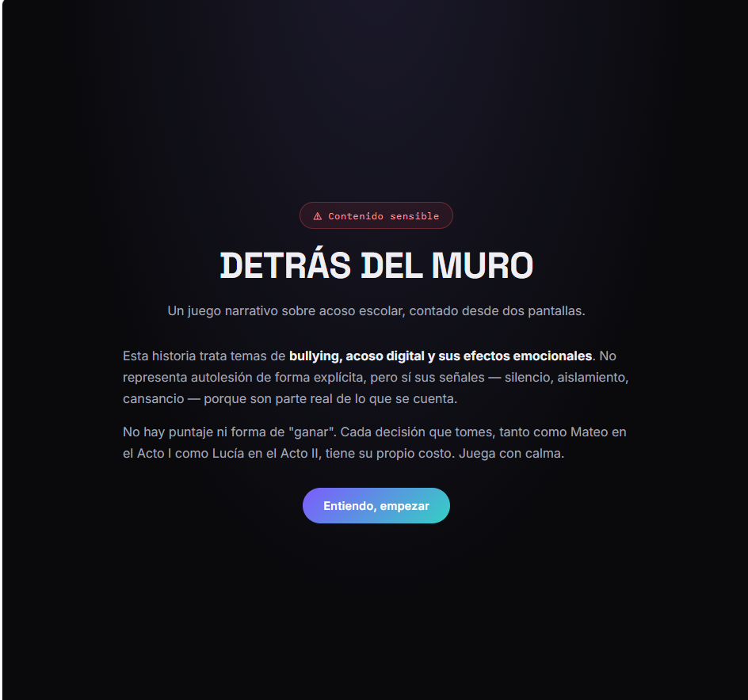
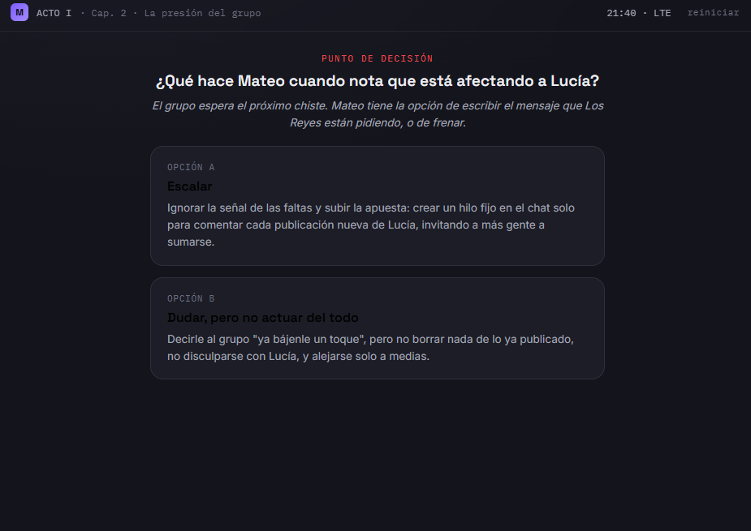
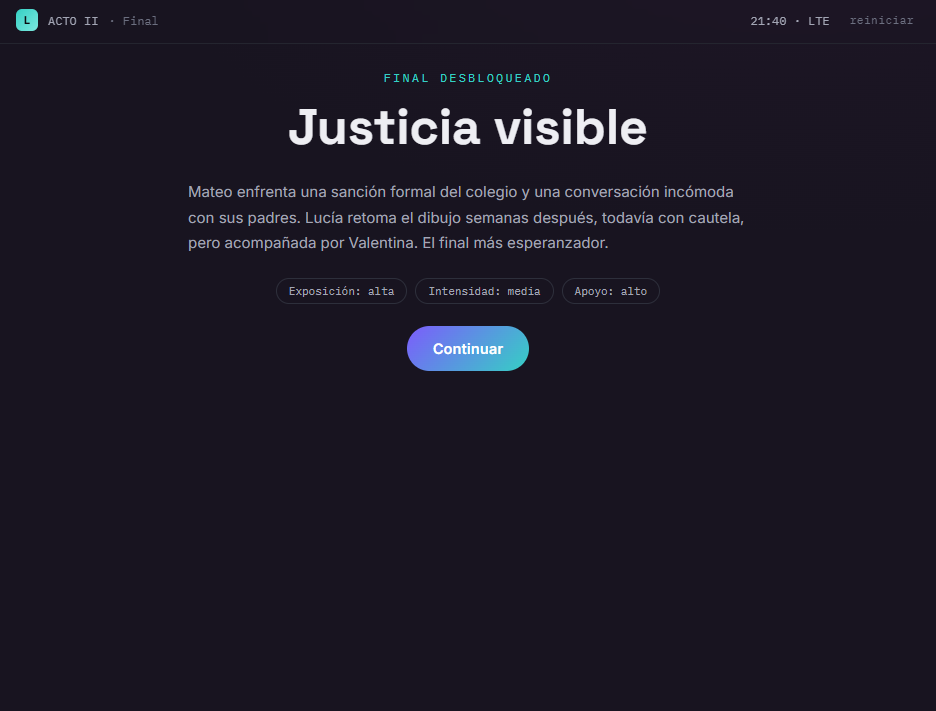

# 🖥️ Detrás del Muro

  

<h1 align="center">🖥️ DETRÁS DEL MURO</h1>

  <b>Una historia interactiva sobre el bullying y sus consecuencias</b>

---

## 📖 Descripción

**Detrás del Muro** es un videojuego narrativo e interactivo que aborda la problemática del **bullying y el acoso escolar**, especialmente en el entorno digital.

El jugador vive la historia desde la perspectiva de **Mateo**, un adolescente que forma parte de un grupo de amigos llamado **"Los Reyes"**.

El juego simula la experiencia de estar frente a una computadora, donde el jugador debe interactuar con diferentes situaciones y tomar decisiones que afectan el desarrollo de la historia.

---

## 🎮 Género

**Narrativa · Adventure · Simulación · Educativo**

---

##  Tema

🖥️ **Bullying, presión social y acoso digital**

---

## 👤 Personaje principal

### Mateo

Mateo es un adolescente que pertenece al grupo **"Los Reyes"**.

Al inicio de la historia se encuentra influenciado por la presión de sus compañeros y participa en determinadas acciones para mantener su posición dentro del grupo.

A medida que avanza la historia, Mateo comienza a observar las consecuencias que las acciones del grupo tienen sobre **Lucía**, quien empieza a verse afectada por el acoso.

---

## ⚙️ Mecánica principal

El juego utiliza una mecánica de **narrativa interactiva basada en decisiones**.

###  Sistema de decisiones

El jugador debe decidir si:
* 🔴 **Participa** en las acciones de acoso
* 🟡 **Permite** que el grupo continúe con las burlas
* 🟢 **Intenta detener** el acoso
* ⚖️ **Asume las consecuencias** de sus decisiones

Cada decisión puede:
* Modificar el desarrollo de la historia
* Generar diferentes consecuencias
* Llevar a finales distintos
* Afectar a los personajes

---

## 🕹️ Controles

|    Control    | Acción                                           |
| :-----------: | ------------------------------------------------ |
| ️ **MOUSE**  | Mover el cursor e interactuar con la computadora |
| 🖱️ **CLICK**  | Seleccionar publicaciones, opciones y decisiones |

> El juego está diseñado principalmente para utilizarse con el mouse, simulando la interacción con una computadora.

---

##  Narrativa

**Detrás del Muro** utiliza una **narrativa emergente con estructura ramificada**.

### 🌟 Evolución del personaje

**🟢 Inicio:**
Mateo está influenciado por la presión de sus amigos y busca formar parte de las bromas del grupo.

**🟡 Conflicto:**
Las bromas comienzan a afectar directamente a Lucía. Mateo observa que la situación deja de ser simplemente una broma.

**🔴 Final:**
Dependiendo de las decisiones tomadas, Mateo puede enfrentarse a diferentes consecuencias.

---

## 🏁 Finales y consecuencias

Las decisiones del jugador pueden conducir a diferentes resultados:

### Posibles consecuencias:

* ⚖️ **Sanciones escolares** - Expulsión o suspensión
* 👨‍👩‍👦 **Conversación con los padres** - Enfrentar la realidad
* 💬 **Continuación del conflicto** - El problema persiste
*  **Conciencia** - Primeras señales de arrepentimiento
* ⚠️ **Sin consecuencias** - La impunidad temporal

> El juego muestra que **las decisiones tienen consecuencias**, tanto para quien realiza una acción como para quien la recibe.

---

## 🎓 Propósito educativo

**Detrás del Muro** busca generar conciencia sobre:

*  **El bullying** - Comprender sus efectos devastadores
* 👥 **La presión de grupo** - Cómo influye en nuestras decisiones
* 💻 **El acoso digital** - El daño en redes sociales
* 💚 **La empatía** - Ponerse en el lugar del otro
* ⚖️ **La responsabilidad** - Asumir las consecuencias

### 🎯 Objetivos de aprendizaje

1. Reconocer situaciones de acoso
2. Comprender el impacto del bullying
3. Desarrollar empatía hacia las víctimas
4. Reflexionar sobre la presión social
5. Aprender a tomar decisiones éticas

---

## 🎨 Arte y estilo visual

El juego presenta:

* 💻 **Interfaz de computadora** - Simula un escritorio virtual
*  **Redes sociales** - Publicaciones y mensajes
* 🎨 **Diseño moderno** - Estilo actual de interfaces digitales
* 🖼️ **Elementos visuales** - Fotos, comentarios, reacciones

---

## 🎬 Gameplay

  

---

## 💭 Toma de decisiones

  

Cada decisión que tomas modifica el curso de la historia.

---

## 🏁 Finales

  

Dependiendo de tus elecciones, experimentarás diferentes desenlaces.

---

## 👥 Público objetivo

Dirigido principalmente a:

* 🎓 **Adolescentes de 13-18 años**
*  **Estudiantes de secundaria**
* 👨🏫 **Educadores** - Como herramienta de prevención
* 👨‍👩‍👧‍👦 **Padres de familia** - Para comprender el fenómeno

---

## 🛠️ Tecnologías utilizadas

*  **HTML5** - Estructura e interacción
* 🎨 **CSS3** - Diseño de interfaces
* ⚡ **JavaScript** - Lógica narrativa y decisiones
* 💾 **LocalStorage** - Guardar progreso y decisiones

---

##  Cómo jugar

1. Abre el archivo `index.html` en un navegador
2. Lee atentamente cada situación
3. Haz clic en las opciones que prefieras
4. Reflexiona sobre las consecuencias

---

  🖥️ <b>Detrás del Muro</b> · Tus decisiones tienen consecuencias.

