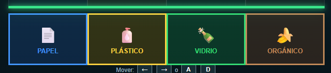
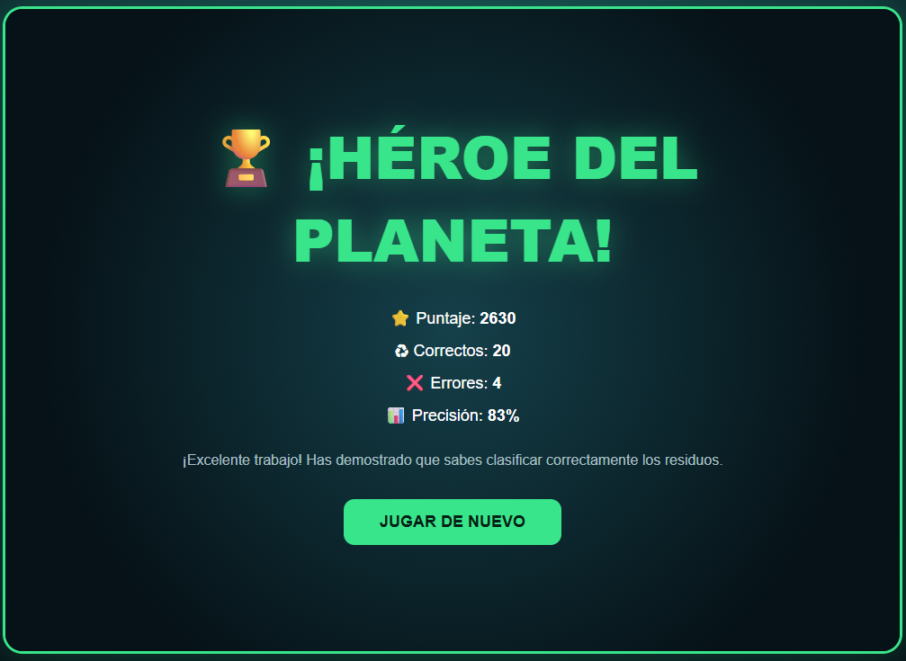

# ♻️ EcoDrop

  

<h1 align="center">♻️ ECODROP</h1>

  <b>Clasifica, recicla y aprende a cuidar el planeta</b>

---

## 🌎 Descripción

**EcoDrop** es un videojuego educativo enfocado en el **reciclaje y la correcta clasificación de residuos**.

El juego utiliza una mecánica de objetos que caen, inspirada en juegos como **Tetris**, combinada con una dinámica rápida similar a juegos musicales como **Guitar Hero**.

El jugador debe controlar los residuos mientras caen y colocarlos en la categoría correspondiente.

---

## 🎯 Objetivo

El objetivo es **clasificar correctamente cada residuo** y colocarlo en el lugar que corresponde.

El jugador debe reconocer rápidamente el tipo de basura y llevarla hacia su categoría correcta.

### ♻️ Categorías

| Categoría | Residuo  |
| :-------: | -------- |
|     📄    | Papel    |
|     🧴    | Plástico |
|     🍾    | Vidrio   |
|     🍎    | Orgánico |

---

## ⚙️ Mecánica principal

Durante la partida los residuos aparecen y comienzan a caer.

El jugador debe:

1. 👀 Identificar el residuo.
2. 🧠 Determinar a qué categoría pertenece.
3. ⬅️➡️ Moverlo utilizando las flechas.
4. ⬇️ Controlar su caída.
5. ♻️ Colocarlo en el lugar correcto.

La velocidad y precisión del jugador son importantes para conseguir un buen resultado.

---

## 🎮 Controles

| Tecla | Acción                   |
| :---: | ------------------------ |
|   ⬅️  | Mover hacia la izquierda |
|   ➡️  | Mover hacia la derecha   |
|   ⬆️  | Mover hacia arriba       |
|   ⬇️  | Acelerar la caída        |

---

## 🎬 Gameplay

  

---

## ♻️ Clasificación de residuos

  

El jugador debe aprender a identificar correctamente cada tipo de residuo:

📄 **Papel**

🧴 **Plástico**

🍾 **Vidrio**

🍎 **Orgánico**

---

## 🏆 Pantalla final

  

---

## 🎓 Propósito educativo

**EcoDrop** busca fomentar el aprendizaje sobre el **reciclaje y la separación correcta de residuos**.

Mediante una mecánica rápida y entretenida, el jugador aprende a reconocer diferentes tipos de basura y colocarlos correctamente.

---

## 🎮 Género

**Puzzle · Arcade · Educativo**

---

  🌎 <b>EcoDrop</b> · Recicla jugando · ♻️

