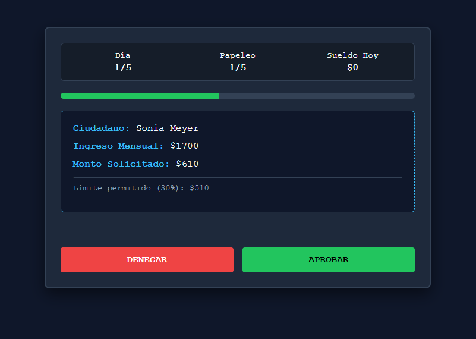
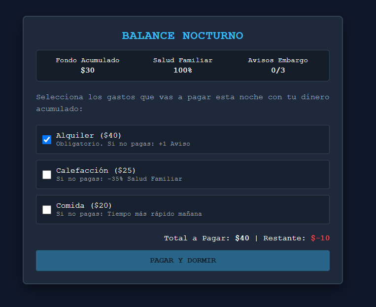

# ❄️ El Misterio del Invierno

  

<h1 align="center">❄️ EL MISTERIO DEL INVIERNO</h1>

  <b>Sobrevive, administra tus recursos y toma decisiones bajo presión</b>

---

## 📖 Concepto / Premisa

**El Misterio del Invierno** es un videojuego ambientado en una ciudad **distópica y congelada**, donde sobrevivir requiere tomar decisiones difíciles y administrar correctamente los recursos disponibles.

El jugador asume el papel de un **Analista de Crédito y Racionamiento**, encargado de revisar y procesar solicitudes durante una jornada laboral.

El dinero obtenido durante el trabajo debe utilizarse posteriormente para cubrir los crecientes gastos de supervivencia de su familia.

Cada decisión puede representar la diferencia entre sobrevivir o quedar en una situación crítica.

---

## 🎮 Género

**Simulation · Strategy · Puzzle · Management · Educativo**

---

## 🎯 Tema

💰 **Educación financiera y administración responsable del dinero**

---

## 🎯 Objetivo del jugador

El objetivo es **sobrevivir un mes completo**, trabajando durante 30 días y administrando correctamente el dinero obtenido.

El jugador debe conseguir suficiente dinero para:

* 💰 **Pagar las deudas**
* 🏠 **Evitar el desahucio**
*  **Comprar alimentos**
* 🔥 **Mantener la calefacción**
* ❤️ **Mantener a salvo a su familia**
*  **Llegar hasta el día 30**

---

## ⚙️ Mecánica principal

El juego combina dos fases principales.

### ☀️ Fase laboral

Durante el día, el jugador trabaja como analista.

Debe revisar documentos y decidir si las solicitudes deben ser **aprobadas o rechazadas**.

Las decisiones deben tomarse bajo presión y dentro de un límite de tiempo.

Los documentos pueden incluir diferentes elementos que deben ser revisados cuidadosamente.

### 🌙 Fase de administración

Al finalizar la jornada laboral, el jugador recibe su salario y debe decidir cómo utilizarlo.

Debe distribuir el dinero entre diferentes gastos:

* 🍞 Alimentación
* 🔥 Calefacción
*  Alquiler
* 💰 Deudas
* 👨‍👩‍👦 Necesidades familiares

El jugador debe encontrar un equilibrio entre pagar sus obligaciones actuales y guardar dinero para situaciones futuras.

---

## 📜 Reglas

Las decisiones del jugador tienen consecuencias económicas.

### ✅ Aciertos

Procesar correctamente los documentos permite obtener dinero.

### ❌ Errores

Los errores pueden generar multas y reducir los recursos disponibles.

### ❤️ Empatía

Las decisiones de empatía no siempre son beneficiosas económicamente y pueden generar penalizaciones.

### 🏠 Gastos impagos

No pagar determinados gastos puede provocar consecuencias como:

* Problemas de salud
* Acumulación de deudas
* Avisos de embargo
* Desahucio

---

##  Progresión

La dificultad aumenta conforme pasan los días.

Cada jornada puede introducir nuevas reglas y situaciones.

Por ejemplo:

*  Documentos más complejos
* 💰 Cálculo de tasas de interés
* 🔍 Detección de sellos falsos
* ️ Mayor presión de tiempo
* 📈 Incremento de los gastos
* ❄️ Mayor presión sobre los recursos familiares

La progresión obliga al jugador a mejorar su capacidad de análisis y administración.

---

## 👨‍👩👦 Personajes

### 👤 El Analista

Es el personaje controlado por el jugador.

Debe trabajar, tomar decisiones y administrar los recursos de su familia.

### 👥 Ciudadanos solicitantes

Son las personas que presentan diferentes solicitudes y documentos.

Sus situaciones pueden variar y el jugador debe decidir cómo procesarlas.

### 👨‍‍👦 Familia

La familia del jugador está representada mediante indicadores de necesidades como:

* ❤️ Salud
* 🍞 Alimentación
* 🔥 Calefacción

El jugador debe mantener estos indicadores en niveles adecuados para poder sobrevivir.

---

## 🎮 Controles

|      Control      | Acción                                                |
| :---------------: | ----------------------------------------------------- |
|   🖱️ **MOUSE**   | Interactuar con documentos e interfaz                 |
|   🖱️ **CLICK**   | Seleccionar, aprobar, rechazar y utilizar elementos   |
| 🖱️ **ARRASTRAR** | Manipular documentos o elementos cuando sea necesario |

---

##  Arte y estilo visual

El juego utiliza un estilo visual **2D Pixel Art** o una interfaz gráfica de apariencia plana.

La ambientación utiliza:

* ❄️ Tonos fríos
* ️ Colores grises
* 🔵 Tonos azules
* 🗂️ Escritorios y documentos desgastados
* 🏢 Ambientes burocráticos
* 🌨️ Sensación constante de frío

El sonido puede complementar la ambientación mediante efectos de:

* 📄 Papel
* 🔖 Sellos metálicos
* 🌬️ Viento frío
* 🖨️ Elementos de oficina

---

##  Gameplay

  

---

## 📄 Revisión de documentos

  

Durante la jornada laboral el jugador debe analizar cuidadosamente los documentos antes de tomar una decisión.

---

## 💰 Administración de recursos

  

Al terminar la jornada, el jugador debe distribuir sus ingresos entre los diferentes gastos de supervivencia.

---

## 🏆 Condición de victoria

El jugador gana cuando consigue:

* 📅 Sobrevivir hasta el **día 30**
* 💰 Pagar la totalidad de la deuda inicial
* 👨‍👩‍👦 Mantener a su familia a salvo
* 🏠 Evitar el desahucio

---

## 💀 Condición de derrota

El jugador pierde si:

* 🏠 Acumula **3 avisos de embargo**
* ❤️ Los indicadores de salud o alimentación de la familia llegan a cero
* 💸 No consigue administrar correctamente los recursos necesarios para sobrevivir

---

## 💡 ¿Cómo enseña a utilizar el dinero responsablemente?

El juego enseña educación financiera mediante situaciones prácticas.

El jugador experimenta directamente conceptos como:

### 💰 Interés compuesto

Las deudas pueden aumentar con el tiempo, mostrando el peligro de no controlarlas.

### 📊 Costo de oportunidad

Gastar dinero en una necesidad puede significar no disponer de recursos para otra necesidad posteriormente.

###  Ahorro

El jugador debe aprender a reservar dinero para situaciones inesperadas.

### ⚖️ Administración

La supervivencia depende de encontrar un equilibrio entre los ingresos y los gastos.

---

## 🎓 Propósito educativo

**El Misterio del Invierno** busca enseñar conceptos básicos de **educación financiera y administración responsable del dinero** mediante una experiencia interactiva.

El jugador comprende que ganar dinero no es suficiente: también es necesario **planificar, priorizar gastos, controlar las deudas y ahorrar para imprevistos**.

---

## 👥 Público objetivo

El juego está dirigido principalmente a jóvenes de **18 a 25 años**, especialmente como herramienta para desarrollar conocimientos relacionados con el ahorro y la administración responsable de los recursos económicos.

---

## 🛠️ Tecnologías utilizadas

* 🌐 **HTML5** - Estructura del juego
*  **CSS3** - Diseño e interfaces
* ⚡ **JavaScript** - Lógica de simulación y estrategia
* 💾 **LocalStorage** - Guardar progreso entre días

---

##  Cómo jugar

1. Abre el archivo `index.html` en un navegador
2. Durante el día: revisa y procesa documentos
3. Por la noche: administra tu salario
4. ¡Sobrevive los 5 días!

---

## 💡 Consejos para sobrevivir

1. 📄 **Sé preciso** - Los errores cuestan dinero
2. ⚡ **Sé rápido** - El tiempo es dinero
3. 💰 **Prioriza** - Paga primero lo esencial
4. 💵 **Ahorra** - Guarda para emergencias
5. ❤️ **Equilibra** - No descuides a tu familia
6. 📊 **Planifica** - Piensa en los días siguientes

---

  ❄️ <b>El Misterio del Invierno</b> · Sobrevivir también es saber administrar.

