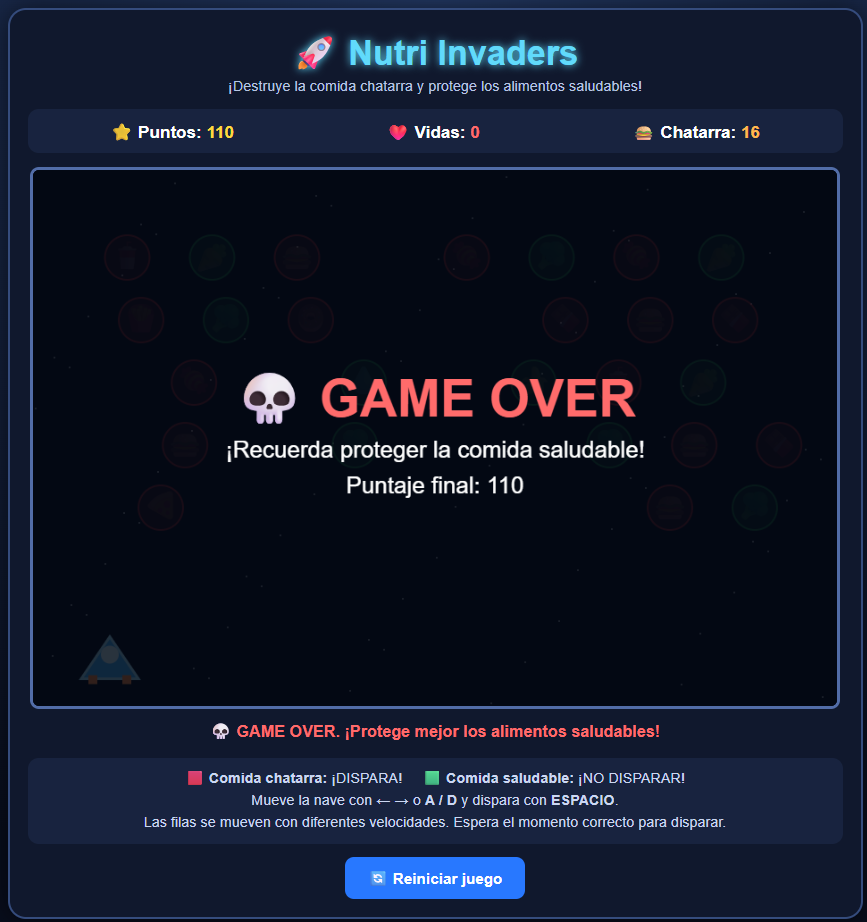

# 🍎 Nutri-Invaders

  

<h1 align="center">🍎 NUTRI-INVADERS</h1>

  <b>Un shooter arcade educativo sobre alimentación saludable</b>

---

## 🎮 Descripción

**Nutri-Invaders** es un videojuego educativo inspirado en la mecánica clásica de **Space Invaders**, adaptado para enseñar de una manera divertida la importancia de una buena alimentación.

El jugador controla una nave espacial que debe desplazarse y disparar contra los alimentos representados como enemigos.

🔴 **Los elementos rojos** representan alimentos chatarra y deben ser destruidos.

🟢 **Los elementos verdes** representan alimentos saludables y **no deben ser destruidos**.

### 🎯 Objetivo

El objetivo principal es destruir correctamente los alimentos chatarra mientras se evita eliminar los alimentos saludables.

De esta manera, el jugador debe aprender a **diferenciar entre alimentos saludables y alimentos poco saludables** mientras juega.

---

## ⚙️ Mecánica principal

La mecánica está inspirada en los clásicos juegos **Space Invaders**.

* 🚀 Controlar una nave espacial.
* ⬅️➡️ Moverse horizontalmente.
* 🔴 Destruir los alimentos chatarra.
* 🟢 Evitar los alimentos saludables.
* 💥 Utilizar disparos para eliminar los objetivos.
* 🏆 Intentar conseguir el mejor resultado posible.

---

## 🎮 Controles

|   Tecla   | Acción                   |
| :-------: | ------------------------ |
|     ⬅️    | Mover hacia la izquierda |
|     ➡️    | Mover hacia la derecha   |
| **SPACE** | 🔫 Disparar              |

---

## 🎬 Gameplay

  

---

## 🥦 Alimentos saludables y comida chatarra

  

El jugador debe identificar rápidamente qué elementos debe destruir y cuáles debe evitar.

🔴 **Rojo → Comida chatarra → Destruir**

🟢 **Verde → Alimento saludable → No destruir**

---

## 🏆 Pantalla final

  

---

## 🎓 Propósito educativo

El videojuego busca enseñar de forma interactiva la diferencia entre **alimentos saludables y alimentos chatarra**, utilizando una mecánica arcade sencilla y entretenida.

---

## 🎮 Género

**Shooter · Arcade · Educativo**

---

  🍎 <b>Nutri-Invaders</b> · Aprende jugando · 🥦

