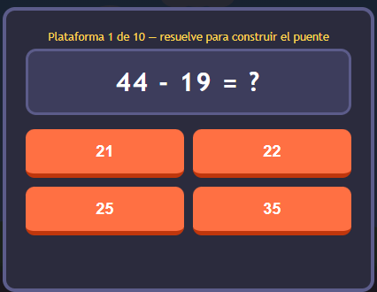
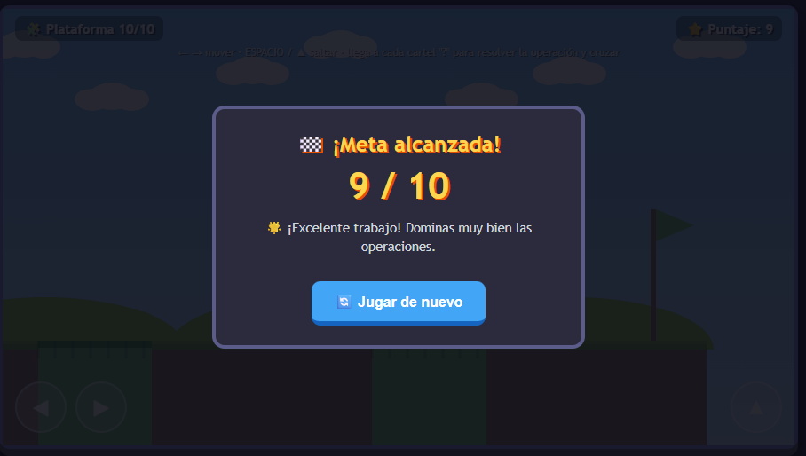

# 🧮 PixelMathQuest

  

<h1 align="center">🧮 PIXELMATHQUEST</h1>

  <b>Una aventura donde aprender matemáticas se convierte en un desafío</b>

---

## 🎮 Descripción

**PixelMathQuest** es un videojuego educativo de plataformas inspirado en los clásicos juegos de aventura como **Mario Bros**.

El jugador controla a un personaje que debe avanzar por diferentes escenarios mientras se encuentra con **preguntas de matemáticas básicas**.

Las preguntas están enfocadas principalmente en:

* ➕ Sumas
* ➖ Restas
* ✖️ Multiplicaciones

---

## 🎯 Objetivo

El objetivo del jugador es **avanzar por el escenario y resolver correctamente las preguntas matemáticas** que aparecen durante la aventura.

Para completar el desafío, el jugador deberá combinar sus habilidades de movimiento con sus conocimientos matemáticos.

---

## ⚙️ Mecánica principal

El juego combina una mecánica de **plataformas** con preguntas educativas.

Durante el recorrido:

1. 🏃 El jugador avanza por el escenario.
2. 🎮 Utiliza los controles para superar el nivel.
3. 🧮 Aparece una pregunta matemática.
4. 🤔 El jugador analiza la operación.
5. ✅ Selecciona la respuesta correcta.
6. 🚀 Continúa avanzando por la aventura.

Las preguntas permiten practicar operaciones matemáticas básicas de una manera interactiva.

---

## 🎮 Controles

| Tecla | Acción                             |
| :---: | ---------------------------------- |
|   ⬅️  | Mover hacia la izquierda           |
|   ➡️  | Mover hacia la derecha             |
|   ⬆️  | Saltar                             |
|   ⬇️  | Agacharse / acción correspondiente |

---

## 🎬 Gameplay

  

---

## 🧮 Preguntas matemáticas

  

Durante la aventura aparecen diferentes desafíos matemáticos relacionados con:

➕ **Suma**

➖ **Resta**

✖️ **Multiplicación**

El jugador debe resolver correctamente cada operación para continuar con su aventura.

---

## 🏆 Pantalla final

  

---

## 🎓 Propósito educativo

**PixelMathQuest** busca reforzar el aprendizaje de las operaciones matemáticas básicas mediante una experiencia de juego.

La combinación de exploración, plataformas y preguntas permite practicar **sumas, restas y multiplicaciones** mientras el jugador avanza por el mundo del videojuego.

---

## 🎮 Género

**Platformer · Adventure · Educativo**

---

  🧮 <b>PixelMathQuest</b> · Aprende matemáticas jugando · 🎮

