

  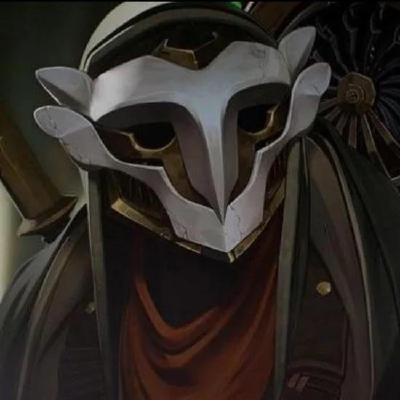

  # 🎮 VIDEO GAME DEVELOPMENT PORTFOLIO

  ### 🕹️ Proyectos • Creatividad • Programación • Videojuegos

   

  **HTML • CSS • JavaScript • GitHub • Inteligencia Artificial**

---

## 👋 Bienvenido a mi portafolio

### 👨‍💻 Cristhian Giovanni Pacsi Pari

**Estudiante de Game Development**

Soy estudiante de **Game Development**, interesado en la programación, el diseño de videojuegos y la creación de experiencias interactivas.

Mis intereses están enfocados en la **acción, la estrategia, la competencia y la gestión**. Disfruto de diferentes estilos de videojuegos y de las experiencias que cada género puede ofrecer.

---

# 🎮 MIS INTERESES EN VIDEOJUEGOS

##  Acción táctica y combate

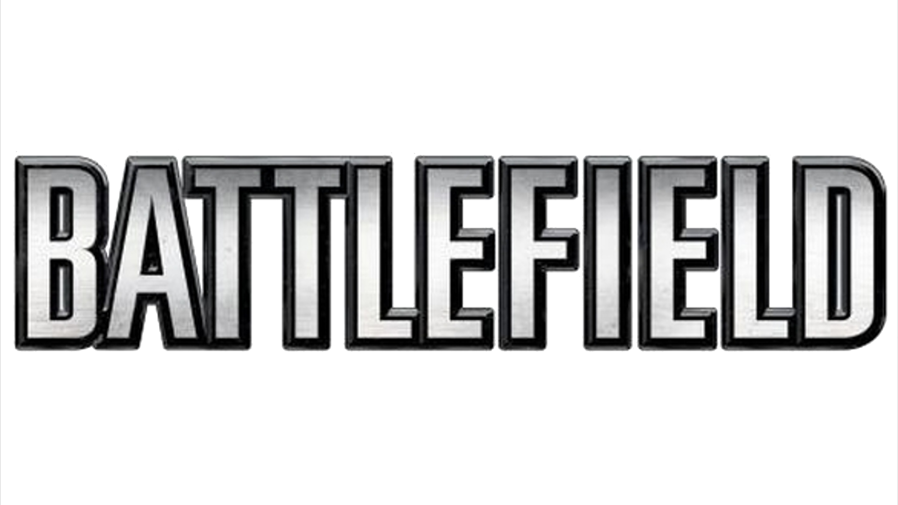

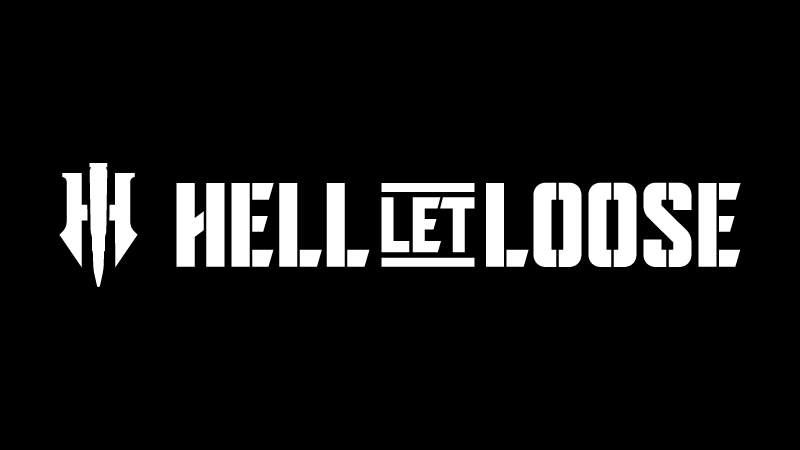

Me encanta la inmersión de los juegos de guerra a gran escala, especialmente la intensidad de los combates, la coordinación entre jugadores y el trabajo en equipo.

**Battlefield** y **Hell Let Loose** destacan para mí por sus escenarios de combate, estrategia y sensación de inmersión.

---

## 🦸 Héroes y competencia

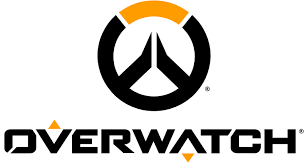

También disfruto de experiencias rápidas y competitivas.

**Overwatch** destaca por su variedad de héroes, habilidades únicas, trabajo en equipo y ritmo de juego.

---

## 🧠 Estrategia y gestión

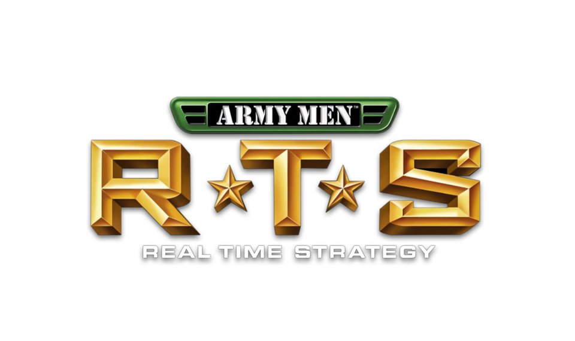

Los juegos de estrategia también forman parte de mis intereses.

Me gusta la posibilidad de **comandar unidades, tomar decisiones, administrar recursos y construir estrategias** para alcanzar la victoria.

**Army Men RTS** es uno de los ejemplos que representan este estilo de juego.

---

# 🕹️ SOBRE ESTE PORTAFOLIO

Este repositorio reúne los **videojuegos y prototipos** desarrollados durante las primeras clases de la asignatura **Game Development**.

Los proyectos fueron desarrollados principalmente utilizando:

### 💻 Tecnologías principales

**HTML5 • CSS3 • JavaScript**

Además, durante el desarrollo se utilizaron herramientas de **Inteligencia Artificial como apoyo** para diferentes tareas de programación, diseño, generación de ideas y resolución de problemas.

---

# 🎮 MIS VIDEOJUEGOS

Actualmente, el portafolio cuenta con **6 videojuegos**, cada uno con una temática y mecánica diferente.

---

##  01. Nutri-Invaders

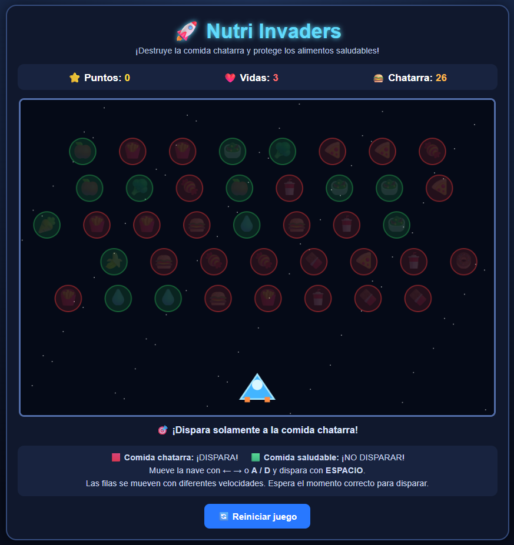

### 📝 Descripción

**Nutri-Invaders** es un shooter arcade educativo inspirado en la mecánica clásica de **Space Invaders**.

El jugador controla una nave espacial y debe destruir los alimentos representados como enemigos.

🔴 Los alimentos rojos representan **comida chatarra** y deben ser destruidos.

🟢 Los alimentos verdes representan **alimentos saludables** y deben evitarse.

### 🎮 Género

**Shooter · Arcade · Educativo**

### 🎯 Tema

🍎 **Alimentación saludable**

### ⚙️ Mecánica principal

Mover la nave y disparar para eliminar los alimentos chatarra sin destruir los alimentos saludables.

 

---

## ♻️ 02. EcoDrop

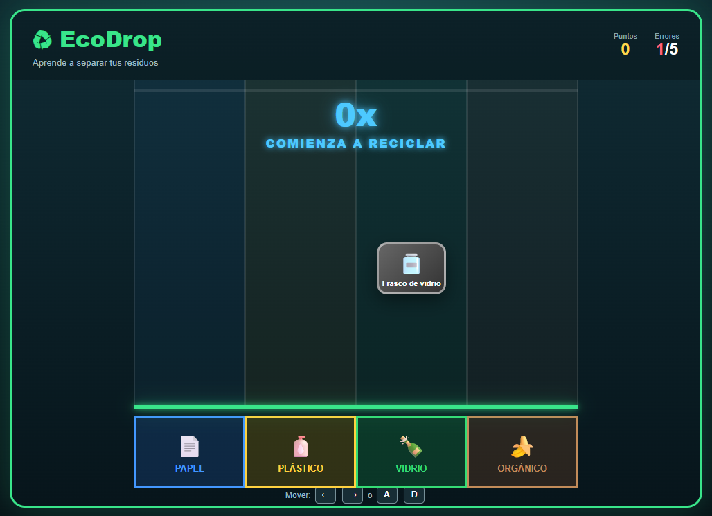

### 📝 Descripción

**EcoDrop** es un videojuego educativo basado en la clasificación de residuos.

Los objetos aparecen cayendo y el jugador debe moverlos para colocarlos en la categoría correcta.

El juego cuenta con cuatro categorías principales:

📄 Papel  
🧴 Plástico  
🍾 Vidrio  
🍎 Orgánico

### 🎮 Género

**Puzzle · Arcade · Educativo**

### 🎯 Tema

🌎 **Reciclaje y cuidado del medio ambiente**

### ️ Mecánica principal

Mover los residuos mientras caen y colocarlos correctamente según el tipo de material.

 

---

##  03. PixelMathQuest

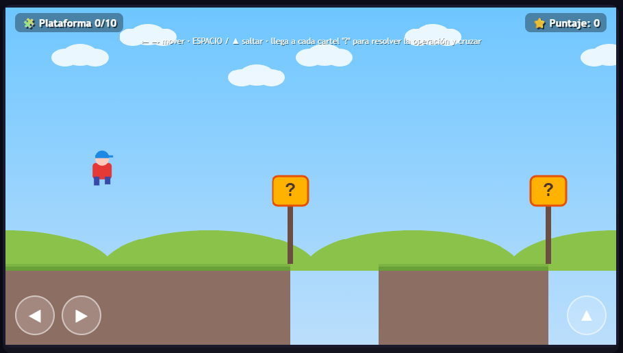

### 📝 Descripción

**PixelMathQuest** es un videojuego educativo de plataformas inspirado en los clásicos juegos de aventura como **Mario Bros**.

Mientras el jugador avanza por el escenario, aparecen diferentes preguntas de matemáticas básicas.

Las operaciones incluyen:

➕ Sumas  
➖ Restas  
✖️ Multiplicaciones

### 🎮 Género

**Platformer · Adventure · Educativo**

### 🎯 Tema

🧮 **Matemáticas básicas**

### ⚙️ Mecánica principal

Avanzar por el escenario mientras se responden correctamente diferentes preguntas matemáticas.

 

---

## ️ 04. Detrás del Muro

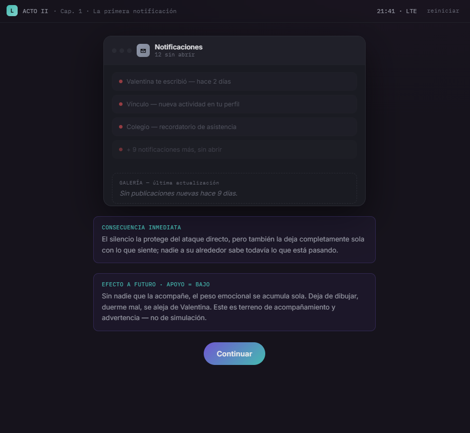

###  Descripción

**Detrás del Muro** es una experiencia narrativa interactiva centrada en la problemática del **bullying y el acoso digital**.

El jugador vive la historia desde la perspectiva de **Mateo**, un adolescente influenciado por la presión de su grupo de amigos.

Las decisiones tomadas durante la historia modifican el desarrollo de los acontecimientos y pueden llevar a diferentes consecuencias.

### 🎮 Género

**Narrativa · Adventure · Simulación · Educativo**

###  Tema

🖥️ **Bullying, presión social y acoso digital**

### ️ Mecánica principal

Interactuar con una computadora utilizando el mouse y tomar decisiones que modifican la historia.

### 🔀 Narrativa

**Narrativa emergente con estructura ramificada.**

Las decisiones del jugador pueden generar diferentes consecuencias y finales.

 

---

## 💧 05. Reto Gota – Salva el Agua

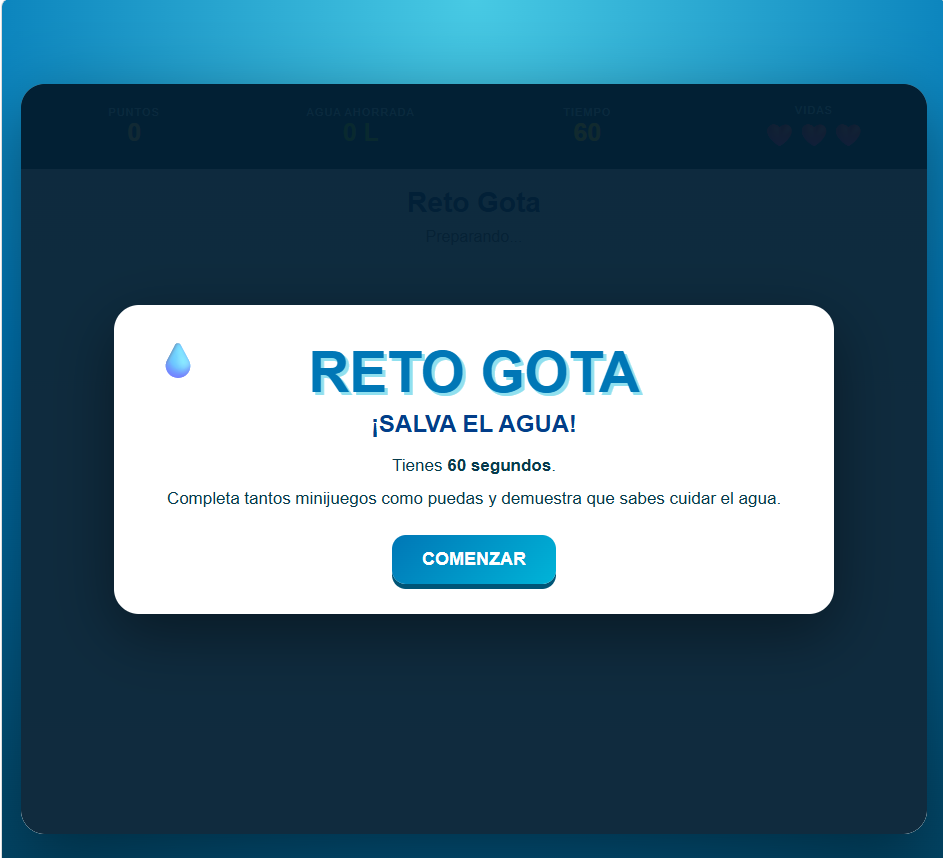

### 📝 Descripción

**Reto Gota – Salva el Agua** es un videojuego educativo compuesto por diferentes **minijuegos relacionados con el cuidado y conservación del agua**.

El jugador debe completar diferentes desafíos realizando acciones correctas para conseguir puntos, ahorrar litros de agua y conservar sus vidas.

### 💧 Minijuegos

El proyecto cuenta con **11 retos diferentes**:

1. 🚰 Cerrar llaves
2. 🔧 Conectar tuberías
3. 💦 Reparar fugas
4. 🪣 Llenar balde
5. 🚿 Ducha eficiente
6. 🩹 Sellar tubería
7. 💧 Atrapar gotas
8. 🔧 Regular válvula
9. 🌱 Regar plantas
10. ♻️ Buenos hábitos
11. 🌧️ Recolectar lluvia

### 🎮 Género

**Puzzle · Arcade · Simulation · Educativo**

###  Tema

💧 **Ahorro y conservación del agua**

### ⚙️ Mecánica principal

Completar diferentes minijuegos en el menor tiempo posible, realizando correctamente acciones relacionadas con el ahorro de agua.

### 🏆 Objetivo

Conseguir la mayor cantidad posible de:

⭐ Puntos  
💧 Litros de agua ahorrados  
❤️ Vidas conservadas

 

---

## ❄️ 06. El Misterio del Invierno

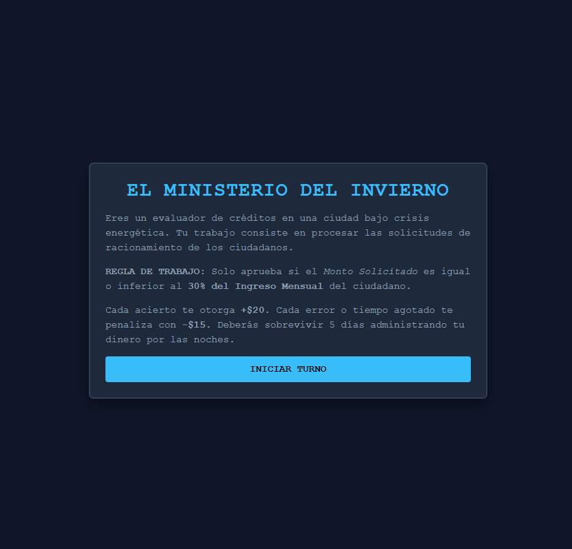

### 📝 Descripción

**El Misterio del Invierno** es un videojuego de simulación y gestión de recursos ambientado en una ciudad distópica y congelada.

El jugador interpreta a un **Analista de Crédito y Racionamiento** que debe trabajar durante **5 días**, procesando documentos y tomando decisiones bajo presión.

El dinero obtenido debe utilizarse para cubrir las necesidades de su familia y administrar correctamente los recursos disponibles.

###  Género

**Simulation · Strategy · Puzzle · Management · Educativo**

###  Tema

💰 **Educación financiera y administración responsable del dinero**

### ⚙️ Mecánica principal

El juego combina dos fases:

**☀️ Fase laboral**

Revisar documentos y decidir si las solicitudes deben ser aprobadas o rechazadas.

**🌙 Fase de administración**

Utilizar el dinero obtenido para pagar gastos y mantener a la familia en condiciones adecuadas.

###  Progresión

El juego se desarrolla durante **5 días**:

🟢 **DÍA 1**  
   ↓  
🟢 **DÍA 2**  
   ↓  
🟡 **DÍA 3**  
   ↓  
 **DÍA 4**  
   ↓  
🔴 **DÍA 5**  
   ↓  
🏆 **FINAL**

La dificultad y la presión económica aumentan conforme avanza el juego.

### 🏆 Condición de victoria

Sobrevivir los **5 días**, administrar correctamente los recursos y mantener a la familia a salvo.

### 💀 Condición de derrota

El jugador puede perder si acumula demasiadas penalizaciones o si los recursos necesarios para mantener a la familia llegan a niveles críticos.

 

---

# 📊 Resumen de proyectos

|    #   | Videojuego                   | Género                 | Tema                  |
| :----: | ---------------------------- | ---------------------- | --------------------- |
|  🍎 01 | **Nutri-Invaders**           | Shooter / Arcade       | Alimentación          |
|  ♻️ 02 | **EcoDrop**                  | Puzzle / Arcade        | Reciclaje             |
|  🧮 03 | **PixelMathQuest**           | Platformer / Adventure | Matemáticas           |
| 🖥️ 04 | **Detrás del Muro**          | Narrative / Adventure  | Bullying              |
|  💧 05 | **Reto Gota**                | Puzzle / Arcade        | Conservación del agua |
|  ❄️ 06 | **El Misterio del Invierno** | Simulation / Strategy  | Educación financiera  |

---

# 🎯 Objetivo del portafolio

El objetivo de este conjunto de proyectos es demostrar cómo los videojuegos pueden utilizarse no solamente como entretenimiento, sino también como una herramienta para **educar, generar conciencia y transmitir diferentes conocimientos**.

Cada videojuego utiliza una mecánica diferente para abordar su temática:

🍎 **Nutri-Invaders** → Shooter Arcade → Alimentación saludable

♻️ **EcoDrop** → Clasificación → Reciclaje

🧮 **PixelMathQuest** → Platformer → Matemáticas

🖥️ **Detrás del Muro** → Narrativa interactiva → Conciencia sobre el bullying

💧 **Reto Gota** → Minijuegos → Cuidado del agua

❄️ **El Misterio del Invierno** → Gestión y simulación → Educación financiera

---

# 🛠️ TECNOLOGÍAS UTILIZADAS

| Tecnología | Utilización |
|---|---|
| 🌐 **HTML5** | Estructura de los videojuegos |
| 🎨 **CSS3** | Diseño e interfaces |
| ⚡ **JavaScript** | Lógica y mecánicas |
| 🧠 **IA** | Apoyo durante el desarrollo |
|  **Git** | Control de versiones |
|  **GitHub** | Publicación y portafolio |
| 💻 **Visual Studio Code** | Entorno de desarrollo |

---

# 🤖 USO DE INTELIGENCIA ARTIFICIAL

La **Inteligencia Artificial** fue utilizada como una herramienta de apoyo durante el desarrollo de los videojuegos.

### 🧠 Aplicaciones de IA

- 💡 Generación y mejora de ideas.
-  Apoyo en programación.
- 🐛 Resolución de errores.
- ⚙️ Modificación y optimización de código.
- 🎨 Propuestas para el diseño visual.
- 🕹️ Desarrollo y mejora de mecánicas.
- 🖼️ Generación de recursos.
- 📚 Apoyo en documentación.

> **La IA fue utilizada como herramienta de apoyo durante el proceso. La integración, adaptación, pruebas y decisiones finales de cada proyecto fueron realizadas durante el desarrollo.**

---

# 📚 ¿QUÉ APRENDÍ?

Durante el desarrollo de estos proyectos adquirí experiencia en diferentes áreas del desarrollo de videojuegos.

### 💻 Programación

- JavaScript.
- Eventos e interacción.
- Lógica de videojuegos.
- Mecánicas de juego.
- Sistemas de puntuación.
- Movimiento y colisiones.

###  Diseño

- Interfaces de usuario.
- Organización visual.
- Experiencia del jugador.
- Presentación de proyectos.

### 🎮 Game Development

- Diseño de mecánicas.
- Creación de prototipos.
- Diseño de dificultad.
- Conceptualización de videojuegos.
- Pruebas y corrección de errores.

###  GitHub

- Creación de repositorios.
- Organización de proyectos.
- Archivos README.
- Publicación de proyectos.
- Uso básico de Git.

---

# 🚀 MEJORAS FUTURAS

Los proyectos pueden continuar evolucionando mediante nuevas versiones.

### 🔮 Posibles mejoras

✨ Nuevos niveles  
👾 Nuevos enemigos  
🏆 Sistema de récords  
🔊 Música y efectos de sonido  
🎨 Animaciones más avanzadas  
🌎 Nuevos escenarios  
⚙️ Nuevas mecánicas  
🎮 Mejor experiencia de usuario  
 Adaptación para diferentes dispositivos

---

#  Galería

Una selección de capturas de los diferentes proyectos:

---

# 🎮 GAME DEVELOPMENT

### 👨‍💻 Cristhian Giovanni Pacsi Pari

**Game Development Portfolio**

**HTML • CSS • JavaScript • GitHub • AI**

---

⭐ **Gracias por visitar mi portafolio** ⭐

