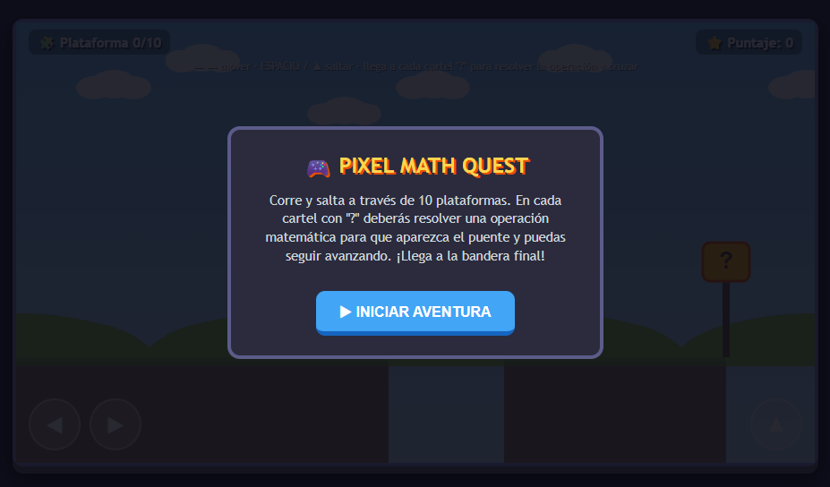
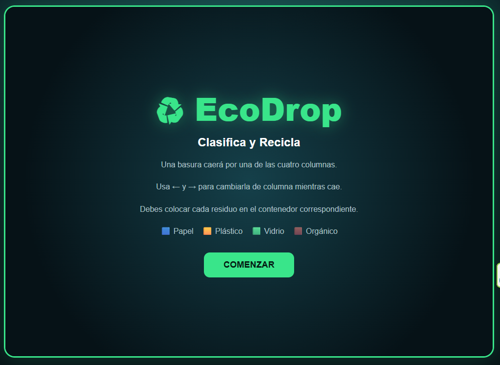
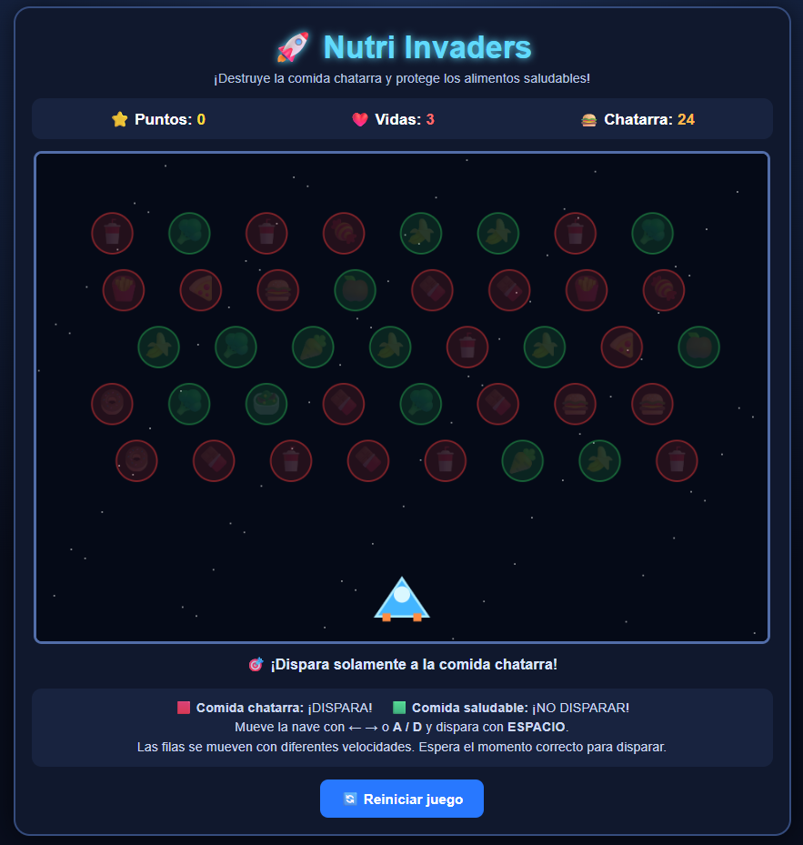

# 🎮 GAME DEVELOPMENT PORTFOLIO

### 🕹️ Proyectos • Creatividad • Programación • Videojuegos

**HTML • CSS • JavaScript • GitHub • Inteligencia Artificial**

---

## 👋 Bienvenido a mi portafolio

### 👨‍💻 Cristhian Giovanni Pacsi Pari

**Estudiante de Game Development**

Soy estudiante de **Game Development**, interesado en la programación, el diseño de videojuegos y la creación de experiencias interactivas.

Mis intereses están enfocados en la **acción, la estrategia, la competencia y la gestión**. Disfruto de diferentes estilos de videojuegos y de las experiencias que cada género puede ofrecer.

---

# 🎮 MIS INTERESES EN VIDEOJUEGOS

## 🔥 Acción táctica y combate

Me encanta la inmersión de los juegos de guerra a gran escala, especialmente la intensidad de los combates, la coordinación entre jugadores y el trabajo en equipo.

**Battlefield** y **Hell Let Loose** destacan para mí por sus escenarios de combate, estrategia y sensación de inmersión.

---

## 🦸 Héroes y competencia

También disfruto de experiencias rápidas y competitivas.

**Overwatch** destaca por su variedad de héroes, habilidades únicas, trabajo en equipo y ritmo de juego.

---

## 🧠 Estrategia y gestión

Los juegos de estrategia también forman parte de mis intereses.

Me gusta la posibilidad de **comandar unidades, tomar decisiones, administrar recursos y construir estrategias** para alcanzar la victoria.

**Army Men RTS** es uno de los ejemplos que representan este estilo de juego.

---

# 🕹️ SOBRE ESTE PORTAFOLIO

Este repositorio reúne los **videojuegos y prototipos** desarrollados durante las primeras clases de la asignatura **Game Development**.

Los proyectos fueron desarrollados principalmente utilizando:

### 💻 Tecnologías principales

**HTML5 • CSS3 • JavaScript**

Además, durante el desarrollo se utilizaron herramientas de **Inteligencia Artificial como apoyo** para diferentes tareas de programación, diseño, generación de ideas y resolución de problemas.

---

# 🎮 MIS VIDEOJUEGOS

---

## 🎯 Pixel Math Quest

### 🧮 Aprende matemáticas mientras juegas

**Pixel Math Quest** es un videojuego educativo de plataformas inspirado en el estilo de los clásicos juegos de aventura y plataformas.

El jugador debe avanzar por diferentes niveles mientras resuelve **operaciones matemáticas básicas**, superando obstáculos y desafíos durante el recorrido.

### 📌 Información del proyecto

| | |
|---|---|
| 🎮 **Género** | Platformer / Educational |
| 💻 **Tecnologías** | HTML, CSS, JavaScript |
| 🤖 **IA** | Utilizada como apoyo |
| 🎯 **Objetivo** | Resolver operaciones matemáticas y superar los niveles |

### 🕹️ Mecánica principal

El jugador avanza por el escenario y se enfrenta a preguntas matemáticas que debe responder correctamente para continuar con la aventura.

### 📚 Aprendizaje

Este proyecto permitió practicar:

- Programación con JavaScript.
- Diseño de videojuegos web.
- Eventos del teclado.
- Sistemas de puntuación.
- Interacción entre jugador y escenario.
- Diseño de interfaces.

👉 **[🎮 Ver proyecto](PixelMathQuest/)**

---

## 🌱 EcoDrop

### ♻️ Clasifica. Reacciona. Recicla.

**EcoDrop** es un videojuego educativo de tipo arcade basado en la **clasificación de residuos**.

Desde la parte superior de la pantalla aparecen diferentes tipos de residuos y el jugador debe reaccionar rápidamente para colocarlos en el contenedor correspondiente.

### 🗑️ Tipos de residuos

| ♻️ Residuo | 🗑️ Categoría |
|---|---|
| 📄 Papel | Papel |
| 🧴 Plástico | Plástico |
| 🍾 Vidrio | Vidrio |
| 🍎 Orgánico | Orgánico |

La dificultad aumenta progresivamente mediante el incremento de la velocidad de caída de los objetos, poniendo a prueba la **atención y los reflejos del jugador**.

### 📌 Información del proyecto

| | |
|---|---|
| 🎮 **Género** | Arcade / Educational |
| 💻 **Tecnologías** | HTML, CSS, JavaScript |
| 🤖 **IA** | Utilizada como apoyo |
| 🎯 **Objetivo** | Clasificar correctamente los residuos |

### 🕹️ Mecánica principal

El jugador debe identificar rápidamente cada objeto y colocarlo en el contenedor correspondiente.

### 📚 Aprendizaje

Este proyecto permitió practicar:

- Manejo de eventos.
- Temporizadores.
- Incremento progresivo de dificultad.
- Diseño de interfaces.
- Programación de mecánicas arcade.

👉 **[🌱 Ver proyecto](EcoDrop/)**

---

## 🥦 Nutri Invaders

### 👾 ¡Defiende una alimentación saludable!

**Nutri Invaders** es un videojuego inspirado en el clásico estilo de **Space Invaders**, pero adaptado a una temática relacionada con la **alimentación saludable**.

El jugador debe identificar los alimentos poco saludables y destruirlos mientras evita atacar los alimentos saludables.

### 🍕 Alimentos y objetivos

🔴 **Alimentos no saludables → Destruir**

🟢 **Alimentos saludables → Evitar**

El jugador debe mantener la precisión y reaccionar rápidamente para conseguir la mayor puntuación posible.

### 📌 Información del proyecto

| | |
|---|---|
| 🎮 **Género** | Shooter / Arcade / Educational |
| 💻 **Tecnologías** | HTML, CSS, JavaScript |
| 🤖 **IA** | Utilizada como apoyo |
| 🎯 **Objetivo** | Identificar correctamente los alimentos no saludables |

### 🕹️ Mecánica principal

El jugador controla el disparo desde la parte inferior de la pantalla mientras diferentes objetos aparecen como enemigos.

La dificultad aumenta mientras avanza la partida, obligando al jugador a mejorar sus reflejos y precisión.

### 📚 Aprendizaje

Este proyecto permitió practicar:

- Movimiento de enemigos.
- Disparos.
- Colisiones.
- Sistema de puntuación.
- Detección de objetivos.
- Aumento de dificultad.
- Mecánicas de arcade.

👉 **[🥦 Ver proyecto](Nutri-Invaders/)**

---

# 🛠️ TECNOLOGÍAS UTILIZADAS

| Tecnología | Utilización |
|---|---|
| 🌐 **HTML5** | Estructura de los videojuegos |
| 🎨 **CSS3** | Diseño e interfaces |
| ⚡ **JavaScript** | Lógica y mecánicas |
| 🧠 **IA** | Apoyo durante el desarrollo |
| 🔧 **Git** | Control de versiones |
| 🐙 **GitHub** | Publicación y portafolio |
| 💻 **Visual Studio Code** | Entorno de desarrollo |

---

# 🤖 USO DE INTELIGENCIA ARTIFICIAL

La **Inteligencia Artificial** fue utilizada como una herramienta de apoyo durante el desarrollo de los videojuegos.

### 🧠 Aplicaciones de IA

- 💡 Generación y mejora de ideas.
- 💻 Apoyo en programación.
- 🐛 Resolución de errores.
- ⚙️ Modificación y optimización de código.
- 🎨 Propuestas para el diseño visual.
- 🕹️ Desarrollo y mejora de mecánicas.
- 🖼️ Generación de recursos.
- 📚 Apoyo en documentación.

> **La IA fue utilizada como herramienta de apoyo durante el proceso. La integración, adaptación, pruebas y decisiones finales de cada proyecto fueron realizadas durante el desarrollo.**

---

# 📚 ¿QUÉ APRENDÍ?

Durante el desarrollo de estos proyectos adquirí experiencia en diferentes áreas del desarrollo de videojuegos.

### 💻 Programación

- JavaScript.
- Eventos e interacción.
- Lógica de videojuegos.
- Mecánicas de juego.
- Sistemas de puntuación.
- Movimiento y colisiones.

### 🎨 Diseño

- Interfaces de usuario.
- Organización visual.
- Experiencia del jugador.
- Presentación de proyectos.

### 🎮 Game Development

- Diseño de mecánicas.
- Creación de prototipos.
- Diseño de dificultad.
- Conceptualización de videojuegos.
- Pruebas y corrección de errores.

### 🐙 GitHub

- Creación de repositorios.
- Organización de proyectos.
- Archivos README.
- Publicación de proyectos.
- Uso básico de Git.

---

# 🚀 MEJORAS FUTURAS

Los proyectos pueden continuar evolucionando mediante nuevas versiones.

### 🔮 Posibles mejoras

✨ Nuevos niveles  
👾 Nuevos enemigos  
🏆 Sistema de récords  
🔊 Música y efectos de sonido  
🎨 Animaciones más avanzadas  
🌎 Nuevos escenarios  
⚙️ Nuevas mecánicas  
🎮 Mejor experiencia de usuario  
📱 Adaptación para diferentes dispositivos  

---

# 📊 RESUMEN DE PROYECTOS

| 🎮 Proyecto | 🎯 Género | 💻 Tecnología | 📌 Estado |
|---|---|---|---|
| 🎯 Pixel Math Quest | Platformer / Educational | HTML / CSS / JS | ✅ Completado |
| 🌱 EcoDrop | Arcade / Educational | HTML / CSS / JS | ✅ Completado |
| 🥦 Nutri Invaders | Shooter / Arcade | HTML / CSS / JS | ✅ Completado |

---

# 🎮 GAME DEVELOPMENT

### 👨‍💻 Cristhian Giovanni Pacsi Pari

**Game Development Portfolio**

**HTML • CSS • JavaScript • GitHub • AI**

---

⭐ **Gracias por visitar mi portafolio** ⭐

