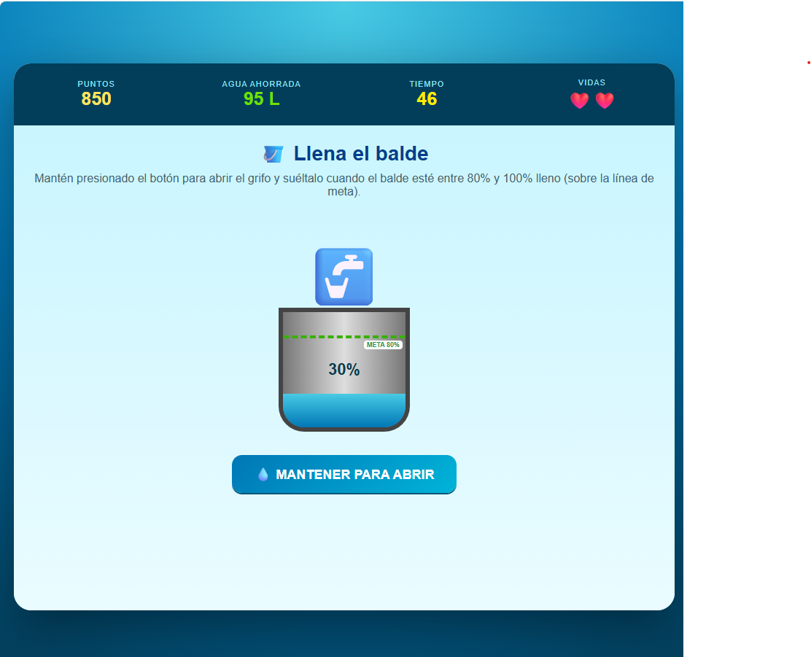
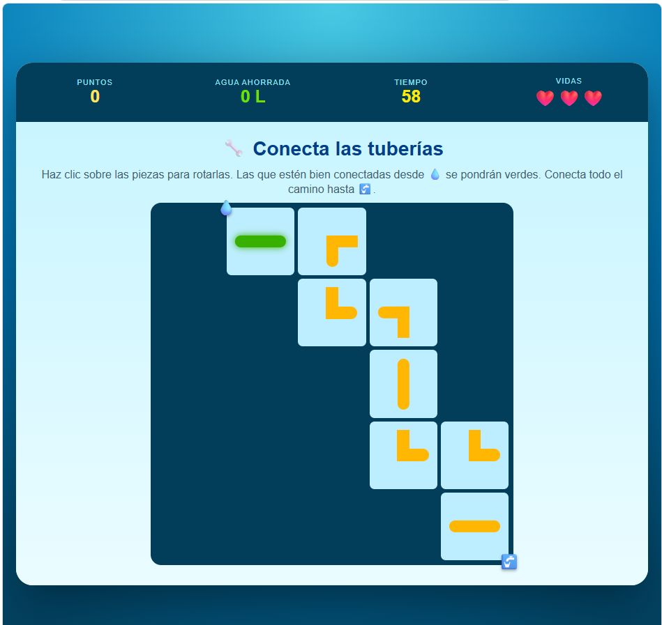
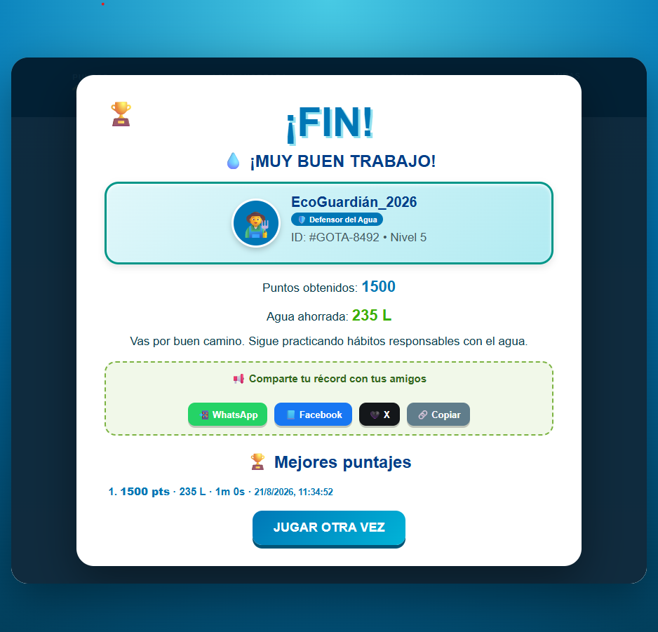

# 💧 Reto Gota – Salva el Agua

  

<h1 align="center">💧 RETO GOTA – SALVA EL AGUA</h1>

  <b>Pequeñas acciones generan grandes cambios</b>

---

## 🌎 Descripción

**Reto Gota – Salva el Agua** es un videojuego educativo compuesto por diferentes **minijuegos relacionados con el ahorro y cuidado del agua**.

El jugador debe completar distintos retos en el menor tiempo posible, realizando acciones correctas para conseguir **puntos y litros de agua ahorrados**.

---

## 🎮 Género

**Puzzle · Arcade · Simulation · Educativo**

---

## 🎯 Tema

 **Ahorro y conservación del agua**

---

## 🎯 Objetivo del jugador

El objetivo principal es completar los diferentes retos relacionados con el cuidado del agua, consiguiendo la mayor cantidad posible de:

* ⭐ **Puntos**
* 💧 **Litros de agua ahorrados**
* ❤️ **Vidas conservadas**

Además, el jugador debe completar los desafíos antes de que termine el tiempo disponible.

---

## 💧 Los 11 minijuegos

El proyecto cuenta con **11 retos diferentes**:

|  #  | Minijuego             | Acción                                          |
| :-: | --------------------- | ----------------------------------------------- |
|  1  | 🚰 Cerrar llaves      | Cerrar cada llave abierta                       |
|  2  | 🔧 Conectar tuberías  | Rotar piezas para conectar las tuberías         |
|  3  | 💦 Reparar fugas      | Hacer clic en las fugas                         |
|  4  |  Llenar balde       | Mantener el nivel correcto                      |
|  5  |  Ducha eficiente    | Cerrar la ducha en el momento adecuado          |
|  6  |  Sellar tubería     | Arrastrar el parche hasta la fuga               |
|  7  | 💧 Atrapar gotas      | Atrapar las gotas antes de que caigan           |
|  8  | 🔧 Regular válvula    | Mover la válvula hacia la zona correcta         |
|  9  | 🌱 Regar plantas      | Regar cuando el indicador esté en la zona verde |
|  10 | ♻️ Buenos hábitos     | Seleccionar las acciones correctas              |
|  11 | 🌧️ Recolectar lluvia | Mover el barril para atrapar las gotas          |

---

## ️ Mecánica principal

El juego está dividido en diferentes **minijuegos**, cada uno basado en una acción relacionada con el ahorro de agua.

El jugador debe identificar rápidamente qué acción realizar y ejecutarla correctamente.

### 🎮 Cómo jugar

1. Completa los diferentes minijuegos
2. Realiza acciones correctas rápidamente
3. Consigue puntos y litros de agua ahorrados
4. Evita perder vidas por errores
5. Termina antes de que se agote el tiempo

---

## 🏆 Sistema de puntuación

### ✅ Recompensas

* **Acción correcta:** +10 puntos
* **Agua ahorrada:** +5-20 litros según el reto
* **Completar rápido:** Bonus de tiempo
* **Sin errores:** Multiplicador x2

### ❌ Penalizaciones

* **Error:** -5 puntos
* **Acción incorrecta:** -1 vida
* **Tiempo agotado:** Fin del minijuego

---

## 🕹️ Controles

|      Control      | Acción                                                |
| :---------------: | ----------------------------------------------------- |
|   🖱️ **CLICK**   | Seleccionar y realizar acciones                       |
| 🖱️ **ARRASTRAR** | Mover objetos como parches o elementos                |
|   🖱️ **MOUSE**   | Interactuar con los diferentes minijuegos             |
|   ⌨️ **FLECHAS**  | Utilizadas en los minijuegos que requieren movimiento |

---

## 🎮 Ejemplos de mecánicas

### 🚰 Cerrar llaves

El jugador debe hacer clic sobre las llaves que se encuentran abiertas para detener el desperdicio de agua.

### 🔧 Conectar tuberías

Las piezas deben rotarse correctamente hasta formar una conexión entre las tuberías.

### 💦 Reparar fugas

El jugador debe localizar las fugas y hacer clic sobre ellas para repararlas.

###  Ducha eficiente

La ducha debe cerrarse dentro del tiempo adecuado para evitar desperdiciar agua.

### 🌧️ Recolectar lluvia

El jugador debe mover el barril para colocarlo debajo de las gotas de lluvia y recolectar la mayor cantidad posible.

---

## 📊 Interfaz del juego

  

La interfaz presenta diferentes indicadores:

* ⭐ **Puntos** - Tu puntuación actual
* 💧 **Agua ahorrada** - Litros totales
* ⏱️ **Tiempo restante** - Cronómetro
* ❤️ **Vidas** - Corazones disponibles

El jugador puede observar su progreso durante los diferentes retos.

---

##  Minijuegos en acción

  

Cada minijuego pone a prueba diferentes habilidades y reflejos.

---

## 🎯 Mecánicas detalladas

  

Aprende las mecánicas específicas de cada reto.

---

## 🏁 Final del juego

  

Completa todos los retos y conviértete en Guardián del Agua.

---

## 🏅 Condición de éxito

El jugador busca completar los diferentes retos obteniendo una buena puntuación y acumulando una gran cantidad de litros de agua ahorrados.

Si consigue completar suficientes desafíos correctamente, puede obtener el reconocimiento:

> 💧 **¡GUARDIÁN DEL AGUA!**

### Niveles de reconocimiento:

* 🥉 **Aprendiz:** 500 puntos
*  **Experto:** 1000 puntos
* 🥇 **Maestro:** 2000 puntos
* 💎 **Guardián del Agua:** 3000+ puntos

---

## 🎓 Propósito educativo

**Reto Gota** busca fomentar hábitos responsables relacionados con el **consumo y conservación del agua**.

###  Aprendizajes clave

1. 🚰 **Cerrar llaves** - No dejar el agua corriendo innecesariamente
2. 🔧 **Reparar fugas** - Una gota puede desperdiciar litros al día
3. 🚿 **Duchas cortas** - Ahorrar minutos salva miles de litros
4. 🌧️ **Recolectar lluvia** - Aprovechar recursos naturales
5.  **Riego eficiente** - Regar en el momento adecuado

A través de diferentes situaciones cotidianas, el jugador aprende que cerrar una llave, reparar una fuga, utilizar correctamente la ducha o recolectar agua de lluvia son acciones que pueden contribuir al cuidado de este recurso.

---

## 🎨 Arte y estilo visual

El juego presenta:

* 💧 **Temática acuática:** Colores azules y turquesas
* 🎨 **Diseño colorido:** Visual atractivo y amigable
* 💦 **Animaciones de agua:** Efectos visuales de gotas
* 🎯 **Iconos claros:** Fácil identificación de elementos

---

## 💡 Consejos para jugar

1. ⚡ **Sé rápido** - El tiempo es limitado
2.  **Precisión** - Evita errores para no perder vidas
3. 💧 **Concéntrate** - Cada gota cuenta
4. 🔄 **Aprende** - Cada minijuego enseña un hábito
5. 🏆 **Supérate** - Mejora tu récord

---

##  Público objetivo

Dirigido a:

*  **Niños de 8-14 años**
* 🎓 **Estudiantes de primaria**
* 🌍 **Conciencia ambiental** - Todas las edades
* 🏫 **Centros educativos** - Herramienta didáctica

---

## 🛠️ Tecnologías utilizadas

*  **HTML5** - Estructura y canvas
* 🎨 **CSS3** - Estilos y animaciones
* ⚡ **JavaScript** - Lógica de minijuegos
*  **Web Audio API** - Efectos de sonido de agua

---

## 🚀 Cómo jugar

1. Abre el archivo `index.html` en un navegador
2. Selecciona un minijuego
3. Completa el reto antes de que se agote el tiempo
4. ¡Ahorra la mayor cantidad de agua posible!

---

  💧 <b>Reto Gota – Salva el Agua</b> · Pequeñas acciones generan grandes cambios. 🌎

